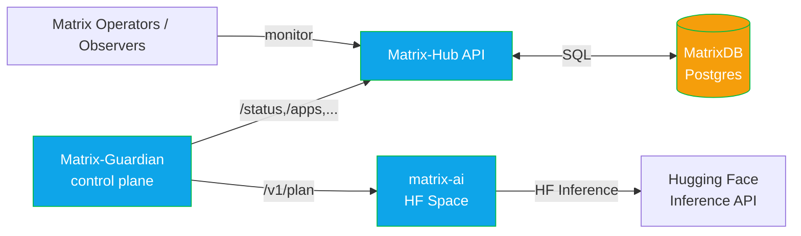
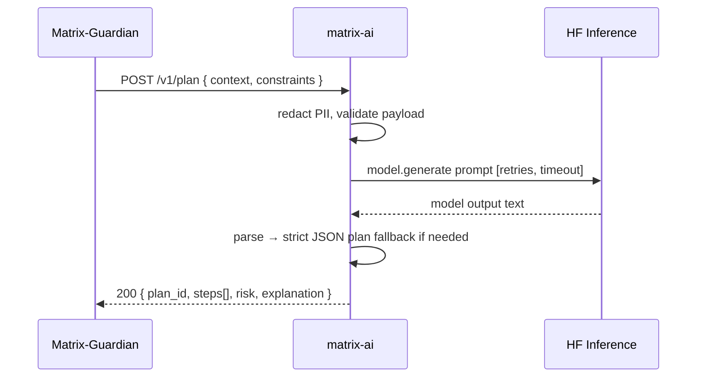

# matrix-ai

**matrix-ai** is the AI planning microservice for the Matrix EcoSystem. It generates **short, low‑risk, auditable remediation plans** from a compact health context provided by **Matrix Guardian**. The service is designed for **Hugging Face Spaces** or **Inference Endpoints**, but also runs locally.

> **Endpoints**
>
> * `POST /v1/plan` – internal API for Matrix Guardian: returns a safe JSON plan.
> * `POST /v1/chat` – (optional) RAG-style Q&A about MatrixHub (kept lightweight in Stage‑1).

The service emphasizes **safety, performance, and auditability**:

* Strict, schema‑validated JSON plans (bounded steps, risk label, rationale)
* PII redaction before calling upstream model endpoints
* Exponential backoff, short timeouts, and structured JSON logs
* In‑memory rate limiting (per‑IP), optional auth for private deployments
* ETag support and response caching for non‑mutating reads

*Last Updated: 2025‑09‑27 (UTC)*

---

## Architecture (at a glance)



### Sequence: `POST /v1/plan`



---

## Quick Start (Local Development)
```bash
# 1) Create venv
python3 -m venv .venv
source .venv/bin/activate

# 2) Install deps
pip install -r requirements.txt

# 3) Configure env (local only; use Space Secrets in prod)
export HF_TOKEN="your_hugging_face_token"

# 4) Run
uvicorn app.main:app --host 0.0.0.0 --port 7860
```

OpenAPI docs: http://localhost:7860/docs

---

## Deploy to Hugging Face Spaces

1) Push the repository to a new Space.
2) In **Settings → Secrets**, add:
   * `HF_TOKEN` (required) – used by the upstream HF Inference client
   * `ADMIN_TOKEN` (optional) – if set, private‑gates `/v1/plan` and `/v1/chat`
3) Choose hardware. CPU is fine for tests; GPU recommended for larger models.
4) The Space will serve FastAPI on the default port; the two endpoints are ready.

> For Inference Endpoints, mirror the same env and start command.

---

## Configuration

All options can be set via environment variables (Space Secrets in HF) or `.env` for local use.

| Variable | Default | Purpose |
|---|---:|---|
| `HF_TOKEN` | — | Token for Hugging Face Inference API (required) |
| `MODEL_NAME` | `meta-llama/Meta-Llama-3.1-8B-Instruct` | Upstream model ID (example) |
| `MAX_NEW_TOKENS` | `256` | Output token cap for plan generations |
| `TEMPERATURE` | `0.2` | Generation temperature |
| `RATE_LIMIT_PER_MIN` | `120` | Per‑IP fixed‑window limit |
| `REQUEST_TIMEOUT_SEC` | `15` | HTTP client timeout to HF |
| `RETRY_MAX_ATTEMPTS` | `3` | Retry budget to HF |
| `CACHE_TTL_SEC` | `30` | Optional in‑memory caching for GET |
| `ADMIN_TOKEN` | — | If set, requires `Authorization: Bearer <ADMIN_TOKEN>` |
| `LOG_LEVEL` | `INFO` | Log level (JSON logs) |

> Names are illustrative; keep them in sync with your `configs/settings.yaml` if present.

---

## API

### `POST /v1/plan`

**Description:** Generate a short, low‑risk remediation plan from a compact app health context.

**Headers**

```
Content-Type: application/json
Authorization: Bearer <ADMIN_TOKEN>   # required iff ADMIN_TOKEN set
```

**Request body (example)**

```json
{
  "context": {
    "entity_uid": "matrix-ai",
    "health": {"score": 0.64, "status": "degraded", "last_checked": "2025-09-27T00:00:00Z"},
    "recent_checks": [
      {"check": "http", "result": "fail", "latency_ms": 900, "ts": "2025-09-27T00:00:00Z"}
    ]
  },
  "constraints": {"max_steps": 3, "risk": "low"}
}
```

**Response (example)**

```json
{
  "plan_id": "pln_01J9YX2H6ZP9R2K9THT2J9F7G4",
  "risk": "low",
  "steps": [
    {"action": "reprobe", "target": "https://service/health", "retries": 2},
    {"action": "pin_lkg", "entity_uid": "matrix-ai"}
  ],
  "explanation": "Transient HTTP failures observed; re-probe and pin to last-known-good if still failing."
}
```

**Status codes**
* `200` – plan generated
* `400` – invalid payload (schema)
* `401/403` – missing/invalid bearer (only if `ADMIN_TOKEN` configured)
* `429` – rate limited
* `502` – upstream model error after retries

### `POST /v1/chat`

*Optional, Stage‑1 placeholder.* Given a query about MatrixHub, returns an answer with citations if a local KB is configured.

---

## Safety & Reliability

* **PII redaction** – tokens/emails removed from prompts as a pre‑filter
* **Strict schema** – JSON plan parsing with fallbacks; rejects unsafe shapes
* **Time‑boxed** – short timeouts and bounded retries to HF Inference
* **Rate‑limited** – per‑IP fixed window (configurable)
* **Structured logs** – JSON logs only; no sensitive payloads are logged

---

## Observability

* Request IDs (correlated across Guardian ↔ AI)
* Latency + retry counters
* Plan success/failure metrics (prom‑friendly if you expose metrics)

---

## Development Notes

* Keep `/v1/plan` **internal** behind a network boundary or `ADMIN_TOKEN`.
* Validate payloads rigorously (Pydantic) and write contract tests for the plan schema.
* If you switch models, re‑run golden tests to guard against plan drift.

---

## License

Apache‑2.0
