# matrix-ai

**matrix-ai** is the AI planning microservice for the Matrix EcoSystem. It generates **short, low-risk, auditable remediation plans** from compact health context provided by **Matrix Guardian**, and also exposes a lightweight **RAG** Q&A over MatrixHub documents.

It is optimized for **Hugging Face Spaces / Inference Endpoints**, but also runs locally and in containers.

> **Endpoints**
>
> * `POST /v1/plan` – internal API for Matrix Guardian: returns a safe JSON plan.
> * `POST /v1/chat` – Q&A (RAG-assisted) over MatrixHub content; returns a single answer.
> * `GET  /v1/chat/stream` – **SSE** token stream for interactive chat (production-hardened).
> * `POST /v1/chat/stream` – same as `GET` but with JSON payloads.

The service emphasizes **safety, performance, and auditability**:

* Strict, schema-validated JSON plans (bounded steps, risk label, rationale)
* PII redaction before calling upstream model endpoints
* **Multi-provider LLM cascade:** **GROQ → Gemini → HF Router (Zephyr → Mistral)** with automatic failover
* Production-safe **SSE** streaming & middleware (no body buffering, trace IDs, CORS, gzip)
* Exponential backoff, short timeouts, and structured JSON logs
* Per-IP rate limiting; optional `ADMIN_TOKEN` for private deployments
* RAG with SentenceTransformers (optional CrossEncoder re-ranker) over `data/kb.jsonl`
* ETag & response caching for non-mutating reads (where applicable)

*Last Updated: 2025-10-01 (UTC)*

---

## Architecture (at a glance)


### Sequence: `POST /v1/plan` (planning)

```mermaid
sequenceDiagram
    participant G as Matrix-Guardian
    participant A as matrix-ai
    participant P as Provider Cascade

    G->>A: POST /v1/plan { context, constraints }
    A->>A: redact PII, validate payload (schema)
    A->>P: generate plan (timeouts, retries)
    alt Provider available
        P-->>A: model output text
    else Provider unavailable/limited
        P-->>A: fallback to next provider
    end
    A->>A: parse → strict JSON plan (safe defaults if needed)
    A-->>G: 200 { plan_id, steps[], risk, explanation }

```



### Sequence: `GET/POST /v1/chat/stream` (SSE chat)


---

## Quick Start (Local Development)

```bash
# 1) Create venv
python3 -m venv .venv
source .venv/bin/activate

# 2) Install deps
pip install -r requirements.txt

# 3) Configure env (local only; use Space Secrets in prod)
cp configs/.env.example configs/.env
# Edit configs/.env with your keys (do NOT commit):
# GROQ_API_KEY=...
# GOOGLE_API_KEY=...
# HF_TOKEN=...

# 4) Run
uvicorn app.main:app --host 0.0.0.0 --port 7860
```

OpenAPI docs: [http://localhost:7860/docs](http://localhost:7860/docs)

---

## Provider Cascade (GROQ → Gemini → HF Router)

**matrix-ai** uses a production-ready multi-provider orchestrator:

1. **Groq** (`llama-3.1-8b-instant`) – free, fast, great latency
2. **Gemini** (`gemini-2.5-flash`) – free tier
3. **HF Router** – `HuggingFaceH4/zephyr-7b-beta` → `mistralai/Mistral-7B-Instruct-v0.2`

Order is configurable via `provider_order`. Providers are skipped automatically if misconfigured or if quotas/credits are exceeded.

**Streaming:** Groq streams true tokens; Gemini/HF may yield one chunk (normalized to SSE).

---

## Configuration

All options can be set via environment variables (Space Secrets in HF), `.env` for local use, and/or `configs/settings.yaml`.

### `configs/settings.yaml` (excerpt)

```yaml
model:
  # HF router defaults (used at the last step)
  name: "HuggingFaceH4/zephyr-7b-beta"
  fallback: "mistralai/Mistral-7B-Instruct-v0.2"
  provider: "featherless-ai"
  max_new_tokens: 256
  temperature: 0.2

  # Provider-specific defaults (free-tier friendly)
  groq_model: "llama-3.1-8b-instant"
  gemini_model: "gemini-2.5-flash"

# Try providers in this order
provider_order:
  - groq
  - gemini
  - router

# Switch to the multi-provider path
chat_backend: "multi"
chat_stream: true

limits:
  rate_per_min: 60
  cache_size: 256

rag:
  index_dataset: ""
  top_k: 4

matrixhub:
  base_url: "https://api.matrixhub.io"

security:
  admin_token: ""
```

### Environment variables

| Variable         |                              Default | Purpose                                   |
| ---------------- | -----------------------------------: | ----------------------------------------- |
| `GROQ_API_KEY`   |                                    — | API key for Groq (primary)                |
| `GOOGLE_API_KEY` |                                    — | API key for Gemini                        |
| `HF_TOKEN`       |                                    — | Token for Hugging Face Inference Router   |
| `GROQ_MODEL`     |               `llama-3.1-8b-instant` | Override Groq model                       |
| `GEMINI_MODEL`   |                   `gemini-2.5-flash` | Override Gemini model                     |
| `MODEL_NAME`     |       `HuggingFaceH4/zephyr-7b-beta` | HF Router primary model                   |
| `MODEL_FALLBACK` | `mistralai/Mistral-7B-Instruct-v0.2` | HF Router fallback                        |
| `MODEL_PROVIDER` |                     `featherless-ai` | HF provider tag (`model:provider`)        |
| `PROVIDER_ORDER` |                 `groq,gemini,router` | Comma-sep. cascade order                  |
| `CHAT_STREAM`    |                               `true` | Enable streaming where available          |
| `RATE_LIMITS`    |                                 `60` | Per-IP req/min (middleware)               |
| `ADMIN_TOKEN`    |                                    — | Gate `/v1/plan` & `/v1/chat*` (Bearer)    |
| `RAG_KB_PATH`    |                      `data/kb.jsonl` | Path to KB (if present)                   |
| `RAG_RERANK`     |                               `true` | Enable CrossEncoder re-ranker (GPU-aware) |
| `LOG_LEVEL`      |                               `INFO` | Structured JSON logs level                |

> Never commit real API keys. Use Space Secrets / Vault in production.

---

## API

### `POST /v1/plan`

**Description:** Generate a short, low-risk remediation plan from a compact app health context.

**Headers**

```
Content-Type: application/json
Authorization: Bearer <ADMIN_TOKEN>   # required if ADMIN_TOKEN set
```

**Request (example)**

```json
{
  "context": {
    "entity_uid": "matrix-ai",
    "health": {"score": 0.64, "status": "degraded", "last_checked": "2025-10-01T00:00:00Z"},
    "recent_checks": [
      {"check": "http", "result": "fail", "latency_ms": 900, "ts": "2025-10-01T00:00:00Z"}
    ]
  },
  "constraints": {"max_steps": 3, "risk": "low"}
}
```

**Response (example)**

```json
{
  "plan_id": "pln_01J9YX2H6ZP9R2K9THT2J9F7G4",
  "risk": "low",
  "steps": [
    {"action": "reprobe", "target": "https://service/health", "retries": 2},
    {"action": "pin_lkg", "entity_uid": "matrix-ai"}
  ],
  "explanation": "Transient HTTP failures observed; re-probe and pin to last-known-good if still failing."
}
```

**Status codes**

* `200` – plan generated
* `400` – invalid payload (schema)
* `401/403` – missing/invalid bearer (only if `ADMIN_TOKEN` configured)
* `429` – rate limited
* `502` – upstream model error after retries

### `POST /v1/chat`

Given a query about MatrixHub, returns an answer with citations **if** a local KB is configured at `RAG_KB_PATH`. Uses the same provider cascade.

### `GET /v1/chat/stream` & `POST /v1/chat/stream`

Server-Sent Events (SSE) streaming of token deltas. Production-safe middleware ensures no body buffering and proper headers (`Cache-Control: no-cache`, `X-Trace-Id`, `X-Process-Time-Ms`, `Server-Timing`).

---

## Safety & Reliability

* **PII redaction** – tokens/emails removed from prompts as a pre-filter
* **Strict schema** – JSON plan parsing with safe defaults; rejects unsafe shapes
* **Time-boxed** – short timeouts and bounded retries to providers
* **Rate-limited** – per-IP fixed window (configurable)
* **Structured logs** – JSON logs with `trace_id` for correlation
* **SSE-safe middleware** – never consumes streaming bodies; avoids Starlette “No response returned” pitfalls

---

## RAG (Optional)

* **Embeddings:** `sentence-transformers/all-MiniLM-L6-v2` (GPU-aware)
* **Re-ranking:** optional `cross-encoder/ms-marco-MiniLM-L-2-v2` (GPU-aware)
* **KB:** `data/kb.jsonl` (one JSON per line: `{ "text": "...", "source": "..." }`)
* **Tunable:** `rag.top_k`, `RAG_RERANK`, `RAG_KB_PATH`

---

## Deployments

### Hugging Face Spaces (recommended for demo)

1. Push repo to a new **Space** (FastAPI).
2. **Settings → Secrets**:

   * `GROQ_API_KEY`, `GOOGLE_API_KEY`, `HF_TOKEN` (as needed by cascade)
   * `ADMIN_TOKEN` (optional; gates `/v1/plan` & `/v1/chat*`)
3. Choose hardware (CPU is fine; GPU improves RAG throughput and cross-encoder).
4. Space runs `uvicorn` and exposes all endpoints.

### Containers / Cloud

* Use a minimal Python base, install with `pip install -r requirements.txt`.
* Expose port `7860` (configurable).
* Set secrets via your orchestrator (Kubernetes Secrets, ECS, etc.).
* Scale with multiple Uvicorn workers; put behind an HTTP proxy that supports streaming (e.g., nginx with `proxy_buffering off` for SSE).

---

## Observability

* **Trace IDs** (`X-Trace-Id`) attached per request and logged
* **Timing headers**: `X-Process-Time-Ms`, `Server-Timing`
* Provider selection logs (e.g., `Provider 'groq' succeeded in 0.82s`)
* Metrics endpoints can be added behind an auth wall (Prometheus friendly)

---


---

## Development Notes

* Keep `/v1/plan` **internal** behind a network boundary or `ADMIN_TOKEN`.
* Validate payloads rigorously (Pydantic) and write contract tests for the plan schema.
* If you switch models, re-run golden tests to guard against plan drift.
* Avoid logging sensitive data; logs are structured JSON only.

---

## License

Apache-2.0

---

**Tip:** The cascade order is controlled by `provider_order` (`groq,gemini,router`). If Groq is rate-limited or missing, the service automatically falls back to Gemini, then Hugging Face Router (Zephyr → Mistral). Streaming works out of the box and is middleware-safe.
